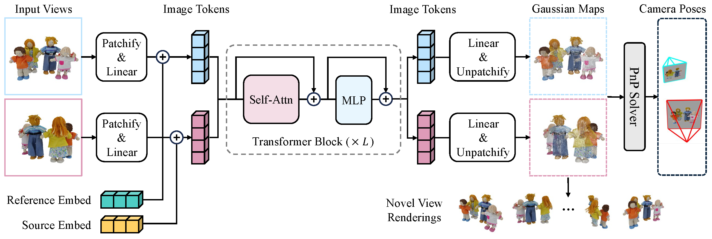

<div align="center">
  
# FreeSplatter: Pose-free Gaussian Splatting for Sparse-view 3D Reconstruction

<a href='https://bluestyle97.github.io/projects/freesplatter/'></a>
<a href="https://github.com/TencentARC/FreeSplatter"></a>
<a href="https://huggingface.co/TencentARC/FreeSplatter"></a> 
<a href="https://huggingface.co/spaces/TencentARC/FreeSplatter"></a> <br>

</div>

---

This repo is the official implementation of FreeSplatter, a feed-forward framework capable of generating high-quality 3D Gaussians from uncalibrated sparse-view images and recovering their camera parameters in mere seconds.

<p align="center"></p>

# 🚩 Todo
We will release the code soon, stay tuned!

# :books: Citation

If you find our work useful for your research or applications, please cite using this BibTeX:

```BibTeX
@article{xu2024freesplatter,
  title={FreeSplatter: Pose-free Gaussian Splatting for Sparse-view 3D Reconstruction},
  author={Xu, Jiale and Gao, Shenghua and Shan, Ying},
  journal={arXiv preprint},
  year={2024}
}
```
